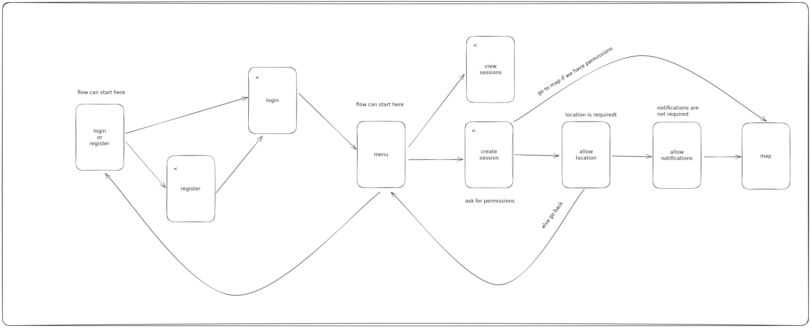

# Navigator: 

## Setup:
Mandatory config class variables:
- smtpHostname (there host where your email is located on, f.e smtp.gmail.com)
- smtpEmail (email where we send the gpx data from)
- smtpPassword (for your email)
- backendUrl (for my case it is https://sportmap.akaver.ee)

The class is located in ./Navigator/Navigator/Config.swift

### Navigator user flow:

## Useful links:

- [Handling 
NavigationStack 
using a router](https://medium.com/@fmmobilelive/navigating-with-navigationpath-in-swiftui-a-structured-approach-91d31e8939b)

- [Live 
Activities](https://betterprogramming.pub/create-live-activities-with-activitykit-on-ios-16-beta-4766a347035b)

- [SwiftSMTP](https://swiftpackageindex.com/Kitura/Swift-SMTP)
